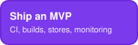
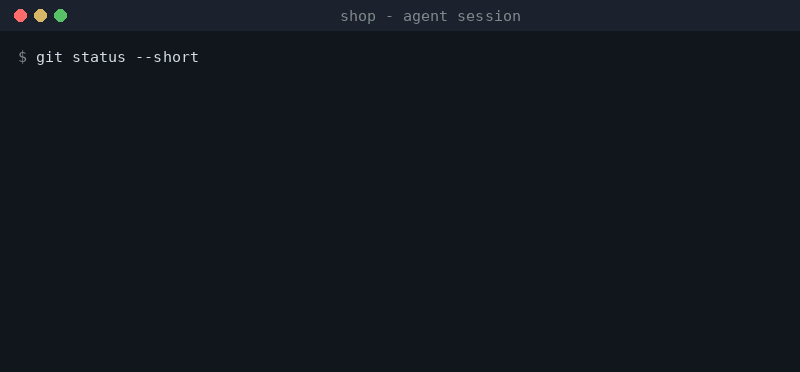
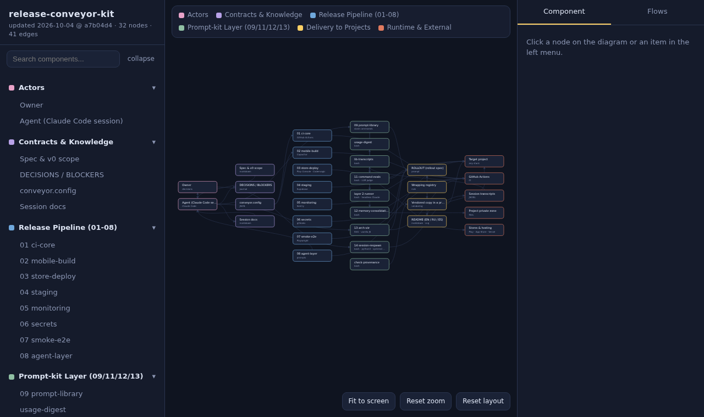

<p align="right"><a href="README.md"></a><a href="README.ru.md"></a><a href="README.es.md"></a></p>

# Release Conveyor Kit

Slash commands and checks that make an AI coding agent show its work instead
of just saying "done".

[](https://github.com/sagittMZ/release-conveyor-kit/actions/workflows/ci.yml)

<p>
  <a href="#add-it-to-your-project"></a>
  <a href="#start-a-new-project"></a>
  <a href="#ship-an-mvp"></a>
  <a href="#the-commands-you-will-use-first"></a>
</p>

You build with an AI agent, and it:

- says "tested" and "verified" with nothing to show for it
- forgets everything the moment the session ends
- does the same job differently every time you ask
- agrees with you instead of pushing back

The kit is a set of folders your agent copies into your repository. It is not
a package and not a CLI, and there is nothing to install.



A real `/precommit` run on a generated repository with three planted defects.
How it was recorded and how to repeat it: [docs/demo/](docs/demo/README.md).

## Add it to your project

For a repository you already have, in any language. You need git and
[Claude Code](https://claude.com/claude-code).

1. Clone the kit next to your project:

   ```bash
   git clone https://github.com/sagittMZ/release-conveyor-kit.git
   ```

2. Open an agent session in **your** project and paste the rollout prompt from
   [modules/09-prompt-library/ROLLOUT.md](modules/09-prompt-library/ROLLOUT.md),
   with the path to your clone filled in.
3. The agent copies the commands in, shows you the diff and waits for your
   word before committing. It does not touch your application code.
4. Type `/precommit` before your next commit.

The commands are plain Markdown prompts, so any agent can read them. The kit
itself was built and run with Claude Code.

## Start a new project

The kit does not generate an application. What it gives a new project is the
harness from the first commit, which is the cheapest moment to adopt it.

1. Create the repository and make a first commit:

   ```bash
   mkdir my-project && cd my-project
   git init && git commit --allow-empty -m "Initial commit"
   ```

2. Follow [Add it to your project](#add-it-to-your-project) from step 1.
3. Start the first feature with `/spec`, plan it with `/impl-plan`, and close
   the session with `/session-wrap`.

This path has run once on an empty repository: 82 files staged, the
structure evals at 62 of 62, every copied file stamped with its source.

## Ship an MVP

For an app on React + Vite + Capacitor + Supabase + Vercel that works and now
has to reach users. The release pipeline adds CI, Android and iOS builds,
store playbooks, staging, monitoring, secrets hygiene and a smoke suite.

1. Add the harness first, as above.
2. Open an agent session in your project and give it the prompt from
   [modules/08-agent-layer/](modules/08-agent-layer/). It interviews you,
   detects your stack, applies the modules in order and verifies each one.
3. Do the manual steps from its final report: accounts, payments, secrets and
   the buttons in store consoles. The modules give a numbered instruction for
   each, and the repository never holds a real secret:
   [modules/06-secrets/](modules/06-secrets/README.md).

On any other stack this part does not apply; the first two do.

## The commands you will use first

| Command | What it does |
|---|---|
| `/spec` | Interviews you about a feature, then writes the spec |
| `/impl-plan` | A phased plan from a team of roles, before any code |
| `/edge-cases` | Error states, empty states and edge cases for a feature |
| `/precommit` | Reviews uncommitted changes: bugs, leaked secrets, forgotten edits |
| `/security-scan` | Security review of a path, run by a separate agent |
| `/release-notes` | Release notes between two tags or commits, grouped by type |
| `/session-wrap` | Ends a session with a short snapshot the next one starts from |
| `/handoff` | Writes the kickoff prompt for the next session |

Six more (`/audit`, `/backlog`, `/scope-triage`, `/eval-command`,
`/consolidate-memory`, `/arch-viz`) and a menu of 21 ready prompts by project
phase are in [modules/09-prompt-library/](modules/09-prompt-library/). Worked
examples: [docs/prompt-kit-guide.md](docs/prompt-kit-guide.md).

## What else is in the box

| Part | What you get | Status |
|---|---|---|
| Commands and prompts (module 09) | The slash commands above and the prompt menu | Runs on the kit itself |
| Command evals (module 11) | A score for every command, so a prompt that got worse is caught before it bites | Runs on the kit itself |
| Memory (module 12) | Session history distilled into notes you review | Runs on the kit itself |
| Architecture page (module 13) | One HTML file with your project's architecture, kept fresh by CI. Example below | Runs on the kit itself |
| Release pipeline (modules 01-08) | CI, Android and iOS builds, store playbooks, staging, monitoring, secrets hygiene, smoke tests. One stack only | Partly extracted from a production pipeline, partly not verified |
| Session respawn (module 14) | Agent sessions and their chat topics come back after a reboot | Proven in part: a real cold start brought every session back; the latest fix has not run cold yet |

[](https://sagittmz.github.io/release-conveyor-kit/docs/arch/)

The architecture page of the kit itself, as module 13 builds it. Click the
picture to open the [live page](https://sagittmz.github.io/release-conveyor-kit/docs/arch/) and walk through the components and
flows.

## What is not verified

The kit never presents a template that has not run as proven. Every module
README splits its content into *extracted from a working project* and *added
by the kit, not verified*. The full list for this release:
[docs/NOT-VERIFIED.md](docs/NOT-VERIFIED.md).

## Go deeper

- Why the kit exists and what broke on the way: [docs/WHY.md](docs/WHY.md)
- The same idea at four levels, from a ten-year-old to an engineer:
  [docs/EXPLAIN.md](docs/EXPLAIN.md)
- Design decisions, numbered, with alternatives and costs:
  [ARCHITECTURE.md](ARCHITECTURE.md)
- Every module: [modules/](modules/)
- Rules for working on this repository: [AGENTS.md](AGENTS.md)

## License

MIT - see [LICENSE](LICENSE).
